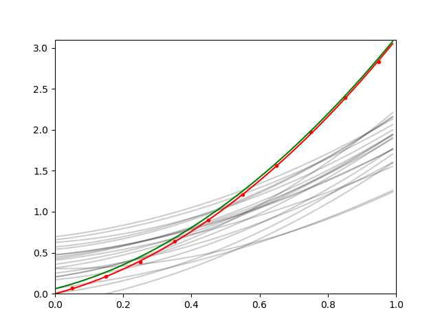

# 4DEnVar_engine

Implements a 4DEnVar solver, as described in [Pinnington et al. (2020)](https://doi.org/10.5194/gmd-13-55-2020)
and the computation of the posterior PDF [Pinnington et al. (2021)](https://doi.org/10.5194/hess-25-1617-2021).
The contents of 4DEnVar.c are an example interface only (i.e. this should be adapted to your own problem). 
The core tools for solving the data assimilation problem are in the file 4DEnVar_engine.c.

`
gsl_vector * fourDEnVar( gsl_matrix * xb, gsl_matrix * hx, gsl_vector * y, gsl_matrix * R, gsl_vector * hx_bar )

An implementation of 4DEnVar as described in: Pinnington, E., Quaife, T., Lawless, A., Williams, K., Arkebauer, T., and Scoby, D.: The Land Variational Ensemble Data Assimilation Framework: LAVENDAR v1.0.0, Geosci. Model Dev., 13, 55–69, https://doi.org/10.5194/gmd-13-55-2020, 2020.

arguments:

gsl_matrix * xb     --- the background ensemble of initial state and/or parameters (n_dims cols; n_ens rows)
gsl_matrix * hx     --- the ensmble of model predicted observations (n_obs cols; e_ens rows)
gsl_vector * y      --- the observations (n_obs rows)
gsl_matrix * R      --- the observation uncertainty covariance matrix (n_obs rows; n_obs cols) 
gsl_vector * hx_bar --- the model predicted observations for the mean of xb (n_obs rows)

returns:

gsl_vector * xa     --- the analysis vector (n_dims rows)
`

gsl_matrix * fourDEnVar_sample_posterior( gsl_matrix * xb, gsl_matrix * hx, gsl_matrix * R, gsl_vector * hx_bar, gsl_vector *xa )

Compute the posterior probability distribution for the 4DEnVar analysis. Implements the method described in the appendix of: Pinnington, E., Amezcua, J., Cooper, E., Dadson, S., Ellis, R., Peng, J., Robinson, E., Morrison, R., Osborne, S., and Quaife, T.: Improving soil moisture prediction of a high-resolution land surface model by parameterising pedotransfer functions through assimilation of SMAP satellite data, Hydrol. Earth Syst. Sci., 25, 1617–1641, https://doi.org/10.5194/hess-25-1617-2021, 2021.

Corrects some errors from that paper.

arguments:

gsl_matrix * xb     --- the background ensemble of initial state and/or parameters (n_dims cols; n_ens rows)
gsl_matrix * hx     --- the ensmble of model predicted observations (n_obs cols; e_ens rows)
gsl_matrix * R      --- the observation uncertainty covariance matrix (n_obs rows; n_obs cols) 
gsl_vector * hx_bar --- the model predicted observations for the mean of xb (n_obs rows)
gsl_vector * xa     --- the analysis vector (n_dims rows) [i.e. returned from fourDEnVar()]

returns:

gsl_matrix * X_a    --- the analysis ensemble of initial state and/or parameters (n_dims cols; n_ens rows)
*/

